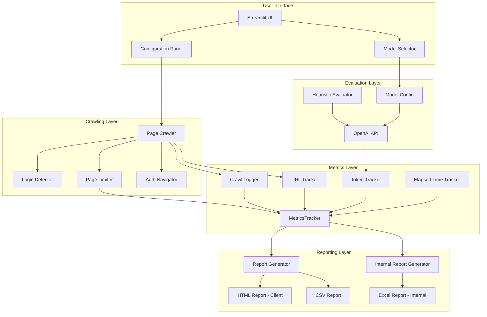

# Design Document: Crawl Metrics Improvements

## Overview

This design addresses critical usability and transparency issues in the GEN-AI-Heuristics evaluation tool. The improvements focus on five core areas:

1. **Crawling Behavior Fixes**: Ensuring the max page limit is respected and the crawler can navigate past login pages without prescriptive URLs
2. **Execution Metrics**: Adding elapsed time tracking and token/cost metrics to help users understand resource consumption
3. **Transparent Logging**: Providing clear explanations when fewer pages are evaluated than requested
4. **Dual Report Generation**: Creating separate internal analysis reports (Excel) and streamlined client-facing reports (HTML)
5. **Model Selection**: Supporting multiple LLM models (GPT-4o, GPT-4o-mini) with dynamic cost calculation

The implementation will introduce a new `MetricsTracker` class to centralize all metrics collection, an `InternalReportGenerator` for detailed Excel reports, modify the existing crawling functions to properly respect page limits and improve authenticated site navigation, and enhance the output reports to include comprehensive execution statistics.

## Architecture



## Components and Interfaces

### 1. MetricsTracker Class

A new centralized class to track all execution metrics throughout a session.

```python
@dataclass
class CrawlMetrics:
    """Metrics related to page crawling"""
    pages_requested: int = 0
    pages_crawled: int = 0
    pages_skipped: int = 0
    skip_reasons: Dict[str, List[str]] = field(default_factory=dict)
    # Skip reason categories: 'navigation_error', 'duplicate', 'domain_mismatch', 'max_limit_reached'

@dataclass
class TokenMetrics:
    """Metrics related to LLM token consumption"""
    total_input_tokens: int = 0
    total_output_tokens: int = 0
    api_calls: int = 0
    
    @property
    def total_tokens(self) -> int:
        return self.total_input_tokens + self.total_output_tokens
    
    def calculate_cost(self, model: str = "gpt-4o-mini") -> float:
        """Calculate cost based on selected model pricing
        
        Model pricing (per 1K tokens):
        - GPT-4o: Input $0.005, Output $0.015
        - GPT-4o-mini: Input $0.00015, Output $0.0006
        """
        pricing = MODEL_PRICING.get(model, MODEL_PRICING["gpt-4o-mini"])
        input_cost = (self.total_input_tokens / 1000) * pricing["input"]
        output_cost = (self.total_output_tokens / 1000) * pricing["output"]
        return input_cost + output_cost

# Model pricing configuration
MODEL_PRICING = {
    "gpt-4o": {"input": 0.005, "output": 0.015},
    "gpt-4o-mini": {"input": 0.00015, "output": 0.0006}
}

@dataclass
class TimeMetrics:
    """Metrics related to execution time"""
    start_time: Optional[datetime] = None
    end_time: Optional[datetime] = None
    
    @property
    def elapsed_seconds(self) -> float:
        if self.start_time and self.end_time:
            return (self.end_time - self.start_time).total_seconds()
        return 0.0
    
    def format_elapsed(self) -> str:
        """Format elapsed time as HH:MM:SS"""
        seconds = int(self.elapsed_seconds)
        hours, remainder = divmod(seconds, 3600)
        minutes, secs = divmod(remainder, 60)
        return f"{hours:02d}:{minutes:02d}:{secs:02d}"

class MetricsTracker:
    """Central metrics tracking for evaluation sessions"""
    
    def __init__(self):
        self.crawl = CrawlMetrics()
        self.tokens = TokenMetrics()
        self.time = TimeMetrics()
    
    def start_session(self):
        """Mark session start time"""
        self.time.start_time = datetime.now()
    
    def end_session(self):
        """Mark session end time"""
        self.time.end_time = datetime.now()
    
    def record_page_crawled(self, url: str):
        """Record a successfully crawled page"""
        self.crawl.pages_crawled += 1
    
    def record_page_skipped(self, url: str, reason: str):
        """Record a skipped page with reason"""
        self.crawl.pages_skipped += 1
        if reason not in self.crawl.skip_reasons:
            self.crawl.skip_reasons[reason] = []
        self.crawl.skip_reasons[reason].append(url)
    
    def record_api_call(self, input_tokens: int, output_tokens: int):
        """Record token usage from an API call"""
        self.tokens.total_input_tokens += input_tokens
        self.tokens.total_output_tokens += output_tokens
        self.tokens.api_calls += 1
    
    def get_summary(self) -> dict:
        """Get complete metrics summary"""
        cost = self.tokens.calculate_cost()
        pages = self.crawl.pages_crawled if self.crawl.pages_crawled > 0 else 1
        return {
            "elapsed_time": self.time.format_elapsed(),
            "elapsed_seconds": self.time.elapsed_seconds,
            "pages_requested": self.crawl.pages_requested,
            "pages_crawled": self.crawl.pages_crawled,
            "pages_skipped": self.crawl.pages_skipped,
            "skip_reasons": self.crawl.skip_reasons,
            "total_input_tokens": self.tokens.total_input_tokens,
            "total_output_tokens": self.tokens.total_output_tokens,
            "total_tokens": self.tokens.total_tokens,
            "api_calls": self.tokens.api_calls,
            "estimated_cost_usd": round(cost, 4),
            "cost_per_page": round(cost / pages, 4)
        }
```

### 2. Enhanced Crawling Functions

Modifications to existing crawl functions to properly respect page limits and log skip reasons.

```python
async def crawl_with_metrics(
    page: Page,
    start_url: str,
    base_domain: str,
    max_pages: int,
    metrics: MetricsTracker,
    visited_urls: set,
    url_to_content: dict,
    max_depth: int = 2
) -> None:
    """Enhanced crawl function with proper page limiting and metrics"""
    
    async def crawl(current_url: str, depth: int):
        # Check max pages limit FIRST
        if len(visited_urls) >= max_pages:
            metrics.record_page_skipped(current_url, "max_limit_reached")
            return
        
        # Check duplicate
        if current_url in visited_urls:
            metrics.record_page_skipped(current_url, "duplicate")
            return
        
        # Check depth
        if depth > max_depth:
            metrics.record_page_skipped(current_url, "max_depth_exceeded")
            return
        
        # Check domain
        link_domain = urlparse(current_url).netloc
        if link_domain != base_domain:
            metrics.record_page_skipped(current_url, "domain_mismatch")
            return
        
        visited_urls.add(current_url)
        
        try:
            await page.goto(current_url, wait_until="domcontentloaded", timeout=120000)
            await page.wait_for_timeout(300)
            content = await page.content()
            cleaned_content = clean_html_content(content)
            url_to_content[current_url] = cleaned_content
            metrics.record_page_crawled(current_url)
        except Exception as e:
            metrics.record_page_skipped(current_url, f"navigation_error: {str(e)[:50]}")
            return
        
        # Only discover more links if under limit
        if len(visited_urls) < max_pages:
            try:
                links = await page.eval_on_selector_all("a[href]", "els => els.map(e => e.href)")
                for link in links:
                    if len(visited_urls) >= max_pages:
                        break
                    await crawl(link, depth + 1)
            except Exception as e:
                pass  # Link extraction errors are non-fatal
    
    await crawl(start_url, 0)
```

### 3. Login Detection Enhancement

```python
async def detect_and_handle_login(
    page: Page,
    login_url: str,
    username: str,
    password: str,
    username_selector: str,
    password_selector: str,
    submit_selector: str,
    metrics: MetricsTracker
) -> bool:
    """Detect login page and attempt authentication"""
    try:
        await page.goto(login_url, wait_until="domcontentloaded", timeout=120000)
        
        # Check if we're on a login page by looking for login form elements
        has_username = await page.query_selector(username_selector)
        has_password = await page.query_selector(password_selector)
        
        if has_username and has_password:
            await page.fill(username_selector, username)
            await page.fill(password_selector, password)
            await page.click(submit_selector)
            await page.wait_for_load_state("domcontentloaded")
            await page.wait_for_timeout(1000)
            
            # Verify we navigated away from login
            current_url = page.url
            if current_url != login_url:
                return True
            else:
                metrics.record_page_skipped(login_url, "login_failed_same_page")
                return False
        
        return True  # Not a login page, proceed normally
        
    except Exception as e:
        metrics.record_page_skipped(login_url, f"login_error: {str(e)[:50]}")
        return False
```

### 4. Token Tracking in LLM Calls with Model Selection

```python
def evaluate_heuristic_with_llm(
    prompt: str, 
    page_content: str,
    metrics: MetricsTracker,
    model: str = "gpt-4o-mini"
) -> str:
    """Evaluate heuristics using OpenAI's API with token tracking and model selection"""
    client = OpenAI(api_key=os.getenv('OPENAI_API_KEY'))
    full_prompt = f"{prompt}\n\nPage Content:\n{page_content}"
    
    try:
        response = client.chat.completions.create(
            model=model,  # Use selected model
            messages=[
                {"role": "system", "content": "..."},
                {"role": "user", "content": full_prompt}
            ],
            temperature=0,
            max_tokens=4000
        )
        
        # Track token usage from response
        if response.usage:
            metrics.record_api_call(
                input_tokens=response.usage.prompt_tokens,
                output_tokens=response.usage.completion_tokens
            )
        
        return format_llm_response(response)
        
    except Exception as e:
        return f"Error: {str(e)}"
```

### 5. Internal Report Generator

```python
import pandas as pd
from io import BytesIO

class InternalReportGenerator:
    """Generates detailed internal analysis reports in Excel format"""
    
    def __init__(self, metrics: MetricsTracker, model: str):
        self.metrics = metrics
        self.model = model
    
    def generate_excel_report(self, analysis_json: dict, site_name: str) -> BytesIO:
        """Generate comprehensive Excel report for internal use"""
        output = BytesIO()
        
        with pd.ExcelWriter(output, engine='openpyxl') as writer:
            # Sheet 1: Executive Summary
            summary_data = self._create_summary_sheet()
            summary_df = pd.DataFrame([summary_data])
            summary_df.to_excel(writer, sheet_name='Summary', index=False)
            
            # Sheet 2: All URLs (crawled + skipped)
            urls_df = self._create_urls_sheet()
            urls_df.to_excel(writer, sheet_name='All URLs', index=False)
            
            # Sheet 3: Cost Breakdown
            cost_df = self._create_cost_breakdown_sheet()
            cost_df.to_excel(writer, sheet_name='Cost Breakdown', index=False)
            
            # Sheet 4: Heuristic Scores
            scores_df = self._create_scores_sheet(analysis_json)
            scores_df.to_excel(writer, sheet_name='Heuristic Scores', index=False)
        
        output.seek(0)
        return output
    
    def _create_summary_sheet(self) -> dict:
        """Create summary metrics for first sheet"""
        summary = self.metrics.get_summary()
        return {
            "Site Name": "",  # Filled by caller
            "Model Used": self.model,
            "Elapsed Time": summary["elapsed_time"],
            "Pages Requested": summary["pages_requested"],
            "Pages Crawled": summary["pages_crawled"],
            "Pages Skipped": summary["pages_skipped"],
            "Max Depth": self._calculate_max_depth(),
            "Total Tokens": summary["total_tokens"],
            "Input Tokens": summary["total_input_tokens"],
            "Output Tokens": summary["total_output_tokens"],
            "Estimated Cost (USD)": summary["estimated_cost_usd"],
            "Cost Per Page": summary["cost_per_page"],
            "API Calls": summary["api_calls"]
        }
    
    def _create_urls_sheet(self) -> pd.DataFrame:
        """Create sheet with all URLs including hidden/nested"""
        urls_data = []
        
        # Add crawled URLs
        for url in self.metrics.crawl.crawled_urls:
            urls_data.append({
                "URL": url,
                "Status": "Crawled",
                "Reason": ""
            })
        
        # Add skipped URLs with reasons
        for reason, urls in self.metrics.crawl.skip_reasons.items():
            for url in urls:
                urls_data.append({
                    "URL": url,
                    "Status": "Skipped",
                    "Reason": reason
                })
        
        return pd.DataFrame(urls_data)
    
    def _calculate_max_depth(self) -> int:
        """Calculate max depth from skip reasons"""
        depth_exceeded = self.metrics.crawl.skip_reasons.get("max_depth_exceeded", [])
        return len(depth_exceeded)
```

### 6. Enhanced Authenticated Site Navigation

```python
async def navigate_authenticated_site(
    page: Page,
    login_url: str,
    start_url: str,
    username: str,
    password: str,
    username_selector: str,
    password_selector: str,
    submit_selector: str,
    metrics: MetricsTracker
) -> tuple[bool, str]:
    """
    Navigate authenticated sites with improved post-login discovery.
    Returns (success, landing_page_url)
    """
    try:
        # Step 1: Navigate to login page
        await page.goto(login_url, wait_until="domcontentloaded", timeout=120000)
        
        # Step 2: Perform login
        await page.fill(username_selector, username)
        await page.fill(password_selector, password)
        await page.click(submit_selector)
        await page.wait_for_load_state("networkidle", timeout=30000)
        
        # Step 3: Capture post-login URL (landing page)
        post_login_url = page.url
        
        # Step 4: Verify we're not still on login page
        if post_login_url == login_url:
            # Check for error messages
            error_selectors = [".error", ".alert-danger", "[role='alert']", ".login-error"]
            for selector in error_selectors:
                error_elem = await page.query_selector(selector)
                if error_elem:
                    error_text = await error_elem.text_content()
                    metrics.record_page_skipped(login_url, f"login_failed: {error_text[:50]}")
                    return False, login_url
            
            metrics.record_page_skipped(login_url, "login_failed_no_redirect")
            return False, login_url
        
        # Step 5: Log successful navigation
        print(f"Successfully authenticated. Landing page: {post_login_url}")
        
        # Step 6: If start_url differs from login_url, navigate there
        if start_url and start_url != login_url and start_url != post_login_url:
            try:
                await page.goto(start_url, wait_until="domcontentloaded", timeout=120000)
                return True, start_url
            except Exception as e:
                # Fall back to post-login landing page
                metrics.record_page_skipped(start_url, f"navigation_error: {str(e)[:50]}")
                return True, post_login_url
        
        return True, post_login_url
        
    except Exception as e:
        metrics.record_page_skipped(login_url, f"auth_error: {str(e)[:50]}")
        return False, login_url
```

## Data Models

### MetricsSummary Schema

```python
MetricsSummary = {
    "elapsed_time": str,           # "01:23:45" format
    "elapsed_seconds": float,      # Raw seconds
    "pages_requested": int,        # Max pages setting
    "pages_crawled": int,          # Actually crawled
    "pages_skipped": int,          # Total skipped
    "skip_reasons": {              # Breakdown by reason
        "max_limit_reached": [str],
        "duplicate": [str],
        "domain_mismatch": [str],
        "navigation_error": [str],
        "max_depth_exceeded": [str]
    },
    "total_input_tokens": int,
    "total_output_tokens": int,
    "total_tokens": int,
    "api_calls": int,
    "estimated_cost_usd": float,
    "cost_per_page": float,
    "model_used": str              # Model name (gpt-4o, gpt-4o-mini)
}
```

### Model Configuration Schema

```python
MODEL_PRICING = {
    "gpt-4o": {
        "input": 0.005,      # $5.00 per 1M tokens
        "output": 0.015,     # $15.00 per 1M tokens
        "description": "Most capable model, higher cost"
    },
    "gpt-4o-mini": {
        "input": 0.00015,    # $0.15 per 1M tokens
        "output": 0.0006,    # $0.60 per 1M tokens
        "description": "Cost-effective model, good for most evaluations"
    }
}
```

### Internal Report Schema

```python
InternalReport = {
    "summary": {
        "site_name": str,
        "model_used": str,
        "elapsed_time": str,
        "pages_requested": int,
        "pages_crawled": int,
        "pages_skipped": int,
        "max_depth": int,
        "total_cost_usd": float
    },
    "all_urls": [
        {
            "url": str,
            "status": str,      # "Crawled" or "Skipped"
            "reason": str,      # Skip reason if applicable
            "depth": int        # Discovery depth
        }
    ],
    "cost_breakdown": {
        "input_tokens": int,
        "output_tokens": int,
        "total_tokens": int,
        "cost_per_page": float,
        "tokens_per_page": float
    }
}
```

### Report Integration

The metrics summary will be added to multiple report types:

**HTML Report (Client-Facing)**: 
- New "Execution Metrics" section after the Executive Summary
- Excludes detailed URL list to avoid misleading information
- Shows summary metrics only

**CSV Report**: 
- Additional columns for metrics or a separate summary row

**Excel Report (Internal)**:
- Complete URL list including all discovered/skipped URLs
- Detailed cost breakdown per page
- Max depth information
- Model used and pricing details


## Correctness Properties

*A property is a characteristic or behavior that should hold true across all valid executions of a system-essentially, a formal statement about what the system should do. Properties serve as the bridge between human-readable specifications and machine-verifiable correctness guarantees.*

Based on the acceptance criteria analysis, the following correctness properties have been identified:

### Property 1: Max Page Limit Enforcement

*For any* max page limit N (where N > 0), the number of pages crawled by the Crawler SHALL never exceed N.

**Validates: Requirements 1.1**

### Property 2: Prescriptive URL Prioritization

*For any* set of prescriptive URLs P and max page limit N, if |P| <= N, then all URLs in P SHALL be included in the crawled pages set.

**Validates: Requirements 1.3**

### Property 3: Time Tracking Consistency

*For any* evaluation session with start time S and end time E (where E > S), the elapsed_seconds property SHALL equal (E - S).total_seconds() and format_elapsed() SHALL return a string in HH:MM:SS format.

**Validates: Requirements 3.1, 3.2, 3.3**

### Property 4: Token Accumulation Correctness

*For any* sequence of API calls with token counts [(i1, o1), (i2, o2), ..., (in, on)], the total_input_tokens SHALL equal sum(i1..in) and total_output_tokens SHALL equal sum(o1..on).

**Validates: Requirements 4.1, 4.2**

### Property 5: Cost Calculation Accuracy with Model Selection

*For any* token metrics with input tokens I, output tokens O, and selected model M, the calculated cost SHALL equal (I/1000 * M.input_price) + (O/1000 * M.output_price), and cost_per_page SHALL equal total_cost / pages_crawled.

**Validates: Requirements 4.3, 4.4, 4.5, 8.3**

### Property 6: Skip Reason Categorization

*For any* page skip event with URL U and reason R, the skip_reasons dictionary SHALL contain U in the list for category R, and pages_skipped SHALL equal the sum of all URLs across all skip reason categories.

**Validates: Requirements 5.1, 5.3, 5.4, 5.5**

### Property 7: Metrics Summary Completeness

*For any* completed evaluation session, the get_summary() method SHALL return a dictionary containing all required fields: elapsed_time, pages_requested, pages_crawled, pages_skipped, skip_reasons, total_input_tokens, total_output_tokens, total_tokens, api_calls, estimated_cost_usd, cost_per_page, and model_used.

**Validates: Requirements 6.1, 6.2**

### Property 8: Internal Report URL Completeness

*For any* crawl session, the internal Excel report SHALL contain all URLs that were either crawled or skipped, such that the union of crawled URLs and all URLs in skip_reasons equals the complete set of URLs in the report.

**Validates: Requirements 7.2**

### Property 9: Client Report URL Exclusion

*For any* generated client-facing HTML report, the report SHALL NOT contain the detailed list of individual URLs that were crawled or skipped.

**Validates: Requirements 7.6**

## Error Handling

### Crawling Errors

| Error Type | Handling Strategy |
|------------|-------------------|
| Navigation timeout | Log as "navigation_error", skip page, continue crawling |
| Content extraction failure | Log as "content_error", skip page, continue crawling |
| Login failure | Log as "login_failed", warn user, attempt to continue with available pages |
| Network errors | Retry once, then log and skip |

### API Errors

| Error Type | Handling Strategy |
|------------|-------------------|
| Rate limiting | Exponential backoff with max 3 retries |
| Token limit exceeded | Truncate content, retry with smaller payload |
| API unavailable | Log error, skip evaluation for that page |

### Metrics Errors

| Error Type | Handling Strategy |
|------------|-------------------|
| Missing usage data in response | Log warning, use 0 for token counts |
| Division by zero (cost per page) | Default to 1 page minimum |

## Testing Strategy

### Dual Testing Approach

This implementation will use both unit tests and property-based tests to ensure correctness:

- **Unit tests**: Verify specific examples, edge cases, and integration points
- **Property-based tests**: Verify universal properties that should hold across all inputs

### Property-Based Testing Framework

The implementation will use **Hypothesis** for Python property-based testing. Each property test will run a minimum of 100 iterations.

### Property Test Specifications

Each property-based test MUST be tagged with a comment referencing the correctness property:

```python
# **Feature: crawl-metrics-improvements, Property 1: Max Page Limit Enforcement**
@given(max_pages=st.integers(min_value=1, max_value=100))
def test_max_page_limit_enforcement(max_pages):
    ...
```

### Test Categories

#### Unit Tests
- MetricsTracker initialization
- Individual method behavior (record_page_crawled, record_page_skipped, etc.)
- Edge cases (empty sessions, zero pages, etc.)
- HTML report generation with metrics section
- CSV report generation with metrics columns
- Internal Excel report generation
- Model selection and pricing lookup

#### Property-Based Tests
- Property 1: Max page limit enforcement
- Property 3: Time tracking consistency
- Property 4: Token accumulation correctness
- Property 5: Cost calculation accuracy with model selection
- Property 6: Skip reason categorization
- Property 7: Metrics summary completeness
- Property 8: Internal report URL completeness
- Property 9: Client report URL exclusion

#### Integration Tests
- End-to-end crawl with metrics tracking
- Report generation with real metrics data
- Model selection affecting cost calculations
- Dual report generation (HTML + Excel)
